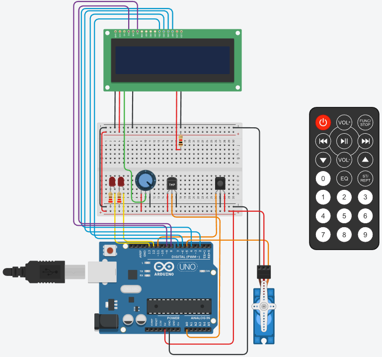

# Sistema de incendio con Arduino - SPD
## Autor: Alejo Nehuén Paiva

**Objetivo:**
El objetivo de este proyecto es diseñar un sistema de incendio utilizando Arduino que pueda
detectar cambios de temperatura y activar un servo motor en caso de detectar un incendio.
Además, se mostrará la temperatura actual y la estación del año en un display LCD.

**Componentes necesarios:**

    Arduino UNO.
    Sensor de temperatura.
    Control remoto IR (Infrarrojo).
    Display LCD (16x2 caracteres).
    Servo motor.
    Cables y resistencias según sea necesario.
    Protoboard para realizar las conexiones.
    Dos leds.
    Funcionalidad requerida:

**Conexiones:**

    Conecta el sensor de temperatura al pin analógico A0 de Arduino.
    Conecta el control remoto IR al pin digital 11 de Arduino.
    Conecta el display LCD utilizando los pines correspondientes de Arduino.
    Conecta el servo motor a uno de los pines PWM de Arduino (por ejemplo, pin 9).

**Control remoto:**

    Configura el control remoto IR para recibir señales.
    Define los comandos necesarios para activar y desactivar el sistema de incendio.
    Utiliza un algoritmo para determinar la estación del año (por ejemplo, rangos de temperatura.
    para cada estación).

**Detección de temperatura:**

    Configura el sensor de temperatura y realiza la lectura de la temperatura ambiente.
    Muestra la temperatura actual en el display LCD.

**Sistema de alarma:**

    Define un umbral de temperatura a partir del cual se considera que hay un incendio (por
    ejemplo, temperatura superior a 60 grados Celsius).
    Cuando se detecta un incendio (temperatura por encima del umbral), se activa el servo
    motor para simular una respuesta del sistema de incendio.

**Mensajes en el display LCD:**

    Muestra la temperatura actual y la estación del año en el display LCD.
    Cuando se detecta un incendio, muestra un mensaje de alarma en el display LCD.
**Punto libre:**

    Se deberá agregar dos leds y darle una funcionalidad de su elección, acorde al
    proyecto previamente detallado.

    Recuerda proporcionar un diagrama de conexiones y el código necesario para implementar
    cada una de las funcionalidades requeridas. Esto ayudará a comprender y construir el
    sistema de incendio con Arduino.

**Aclaraciones para la aprobación de la parte práctica:**

    • Debe haber buen uso de las funciones.
    • El código debe ser prolijo y legible.

## Arduino:

## Codigo:

~~~ C++ 
// C++ code
//
// Librerías usadas
#include<LiquidCrystal.h>
#include<IRremote.h>;
#include <Servo.h>

//Definiciones
#define LED_UNO 13
#define LED_DOS 12
#define SENSOR A0
#define codigo_on 0xFF00BF00
#define func_stop 0xFD02BF00
#define RECV_PIN 11

//Definiciones de variables 
int temperaturaIncendio = 0;
int celsius = 0;
int grado_anterior = 0;

String estacion_promedio;
LiquidCrystal lcd (8,9,7,6,2,4);

int pos = 0;
//Definición del servomotor
Servo servo_5;

void setup()
{
  //Seteo para que el sensor pueda recibir señales infrarrojas.
  IrReceiver.begin(RECV_PIN, DISABLE_LED_FEEDBACK);
  
  pinMode(LED_UNO, OUTPUT);
  pinMode(LED_DOS, OUTPUT);
  pinMode(SENSOR,INPUT);
  
  //Seteo de las celdas del lcd
  lcd.begin(16,2);
  
  //Definición del pin, y los valores mínimos y máximos de pulsaciones.
  servo_5.attach(5, 500, 2500);
  
  Serial.begin(9600);
}

void loop()
{z
  if (IrReceiver.decode())
  {
    Serial.println(""); 
   	Serial.println("CODIGO -->"); 
    //Muestra el valor hexadecimal de la señal recibida en la terminal
    Serial.println(IrReceiver.decodedIRData.decodedRawData); 
   //Espera la próxima señal
    IrReceiver.resume(); 
  }
  switch(IrReceiver.decodedIRData.decodedRawData){
  	case 4278238976:
    	//Umbral de incendio, capeado a 60 grados
  		temperaturaIncendio = 60;
  		//Cálculo para pasar los datos del sensor a grados celsius
  		celsius = map(((analogRead(SENSOR) - 20) * 3.04), 0, 1023, -40, 125);
  		
  		//Código que printea los grados celsius en las celdas superiores
  		lcd.setCursor(0,0);
  		lcd.print("Temp: "+String(celsius)+"C");
  		estacion_promedio = Estacion(celsius);
    	//Código que printea la estación del año en las celdas inferiores
  		lcd.setCursor(0,1);
  		lcd.print("Station:"+String(estacion_promedio));
  		delay(1000);
  		lcd.clear();
    
  		//Función que prende y apaga los leds en caso de incendio
  		Leds(celsius);
    
    	//Función que printea en el lcd un mensaje de alerta. También hace que
    	//el servomotor se empieze a mover, como otro método de alerta.
    	Alerta(celsius,temperaturaIncendio);
	}
}
void Alerta(int celsius, int temperaturaIncendio){

	if (celsius >= temperaturaIncendio)
  	{
    
        lcd.print("ALERTA!!!");
        lcd.setCursor(0,1);
        lcd.print("INCENDIO!");
  	
        for (pos = 0; pos <= 180; pos += 5) {
            servo_5.write(pos);
            delay(10); // Wait for 100 millisecond(s)
        }
        for (pos = 180; pos >= 0; pos -= 5) {
            servo_5.write(pos);
            delay(10); // Wait for 5 millisecond(s)
        }
        lcd.clear();
      }   
}

String Estacion(int temperatura){
    String estacion = "";
  	if (temperatura >= 10 && temperatura <= 17){
    	estacion = "Otono";
  		return estacion;
    }
    else if (temperatura >= 0 && temperatura <= 10){
    	estacion = "Invierno";
        return estacion;
    }
  	else if (temperatura >= 17 && temperatura <= 22){
    	estacion = "Primav.";
        return estacion;
    }
    else if (temperatura >= 22){
    	estacion = "Verano";
        return estacion;
    }
}

void Leds(int temperatura){
  if(temperatura >= 60){
  	digitalWrite(LED_UNO,HIGH);
  	digitalWrite(LED_DOS,HIGH);
    delay(250);
    digitalWrite(LED_UNO,LOW);
  	digitalWrite(LED_DOS,LOW);
  }
}
~~~

**Link del Tinkercad:**

    https://www.tinkercad.com/things/jFMVGw2VWLD-bodacious-tumelo/editel?sharecode=UDx3bPvRSW-xAFvTk9sDMK23sB85_GlvGDBq8lqz0kE